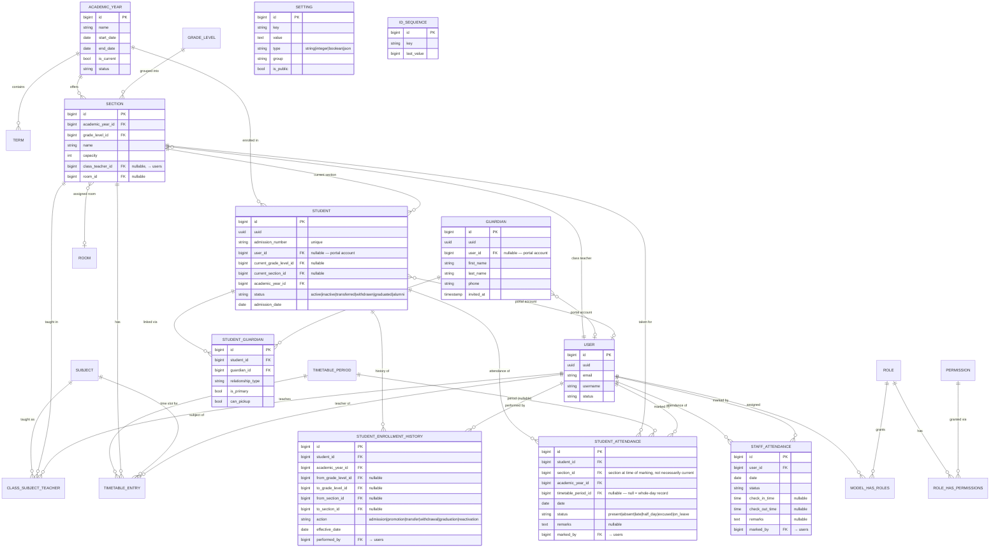
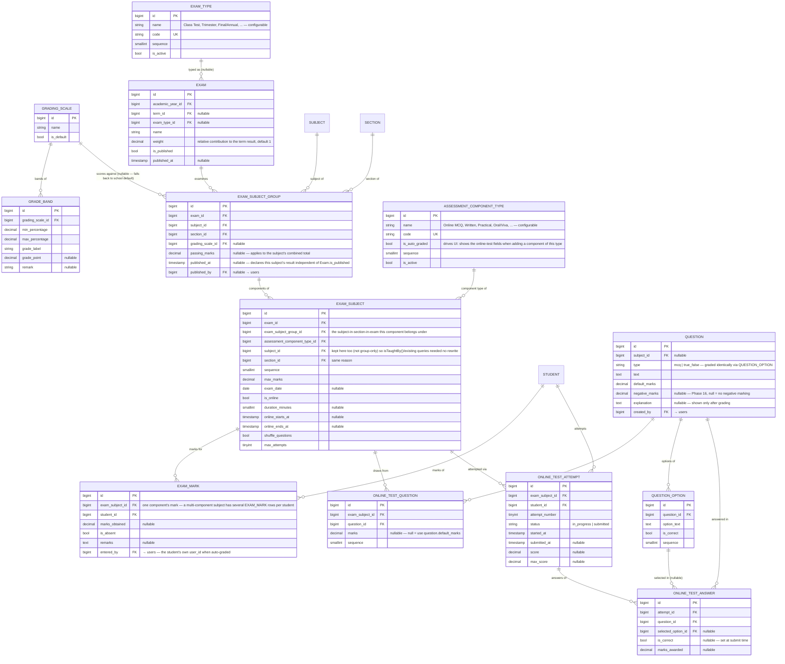
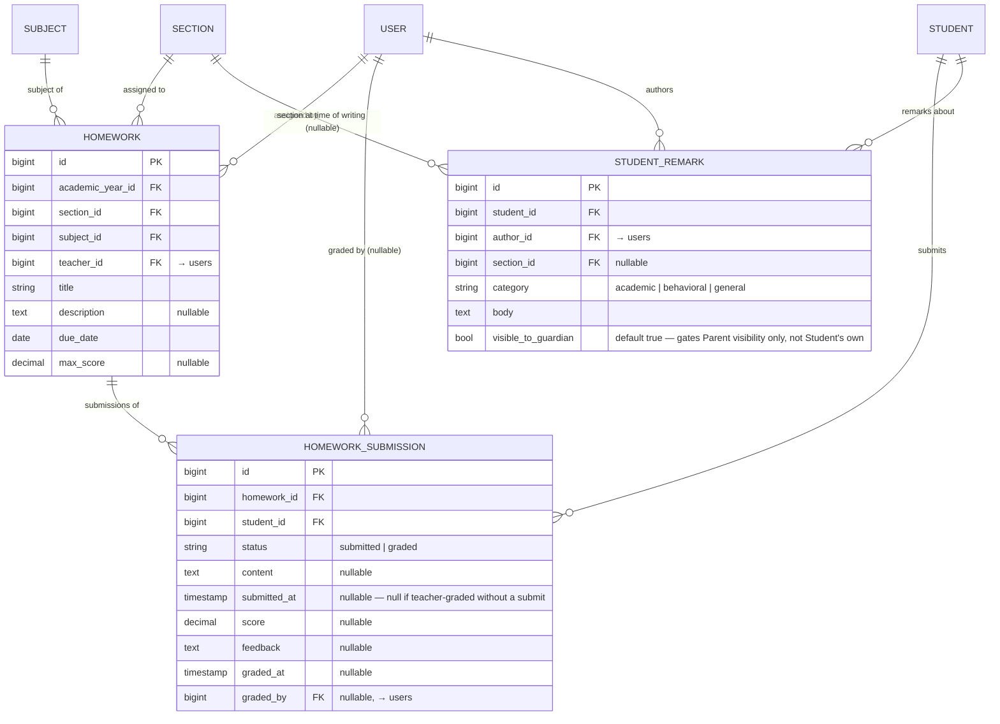
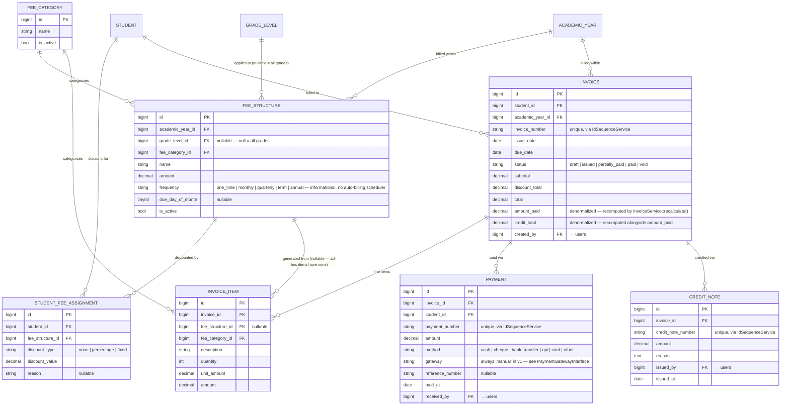
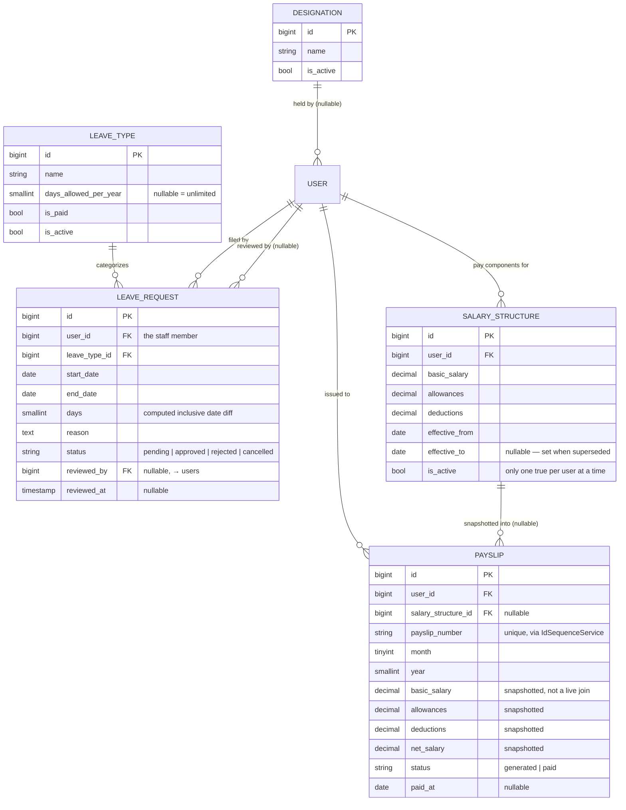
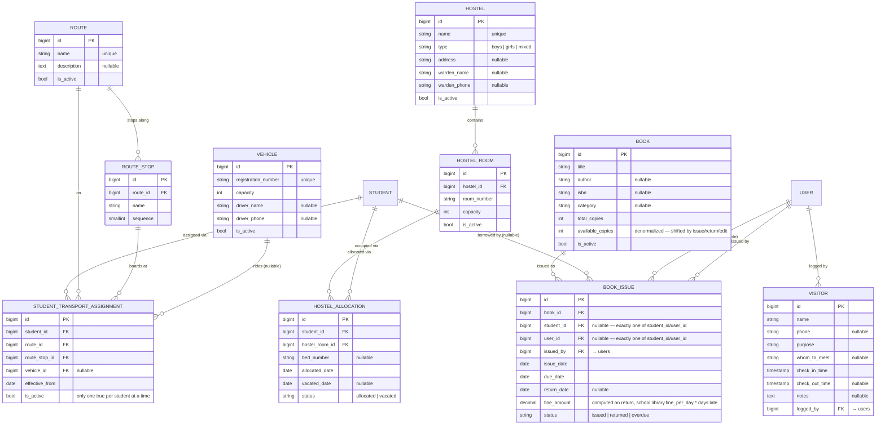
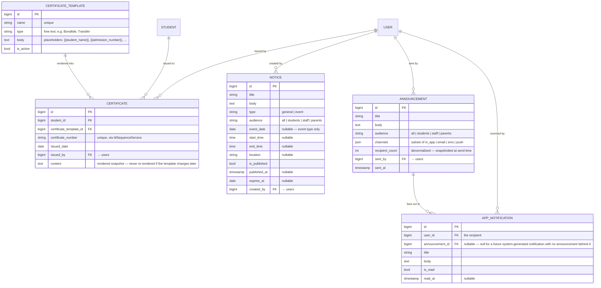

# Database

MySQL in production, SQLite for local dev/tests — migrations are written to
be compatible with both (no MySQL-only or SQLite-only column types/features).
See [setup.md](setup.md) for switching connections and [deployment.md](deployment.md)
for the MySQL cutover.

## Migration order

```
cache, jobs (Laravel's own infrastructure tables)
users, password_reset_tokens, sessions, personal_access_tokens
permission tables (roles, permissions, model_has_roles, model_has_permissions,
                    role_has_permissions)
activity_log
media
settings
id_sequences
academic_years
terms
departments
grade_levels
rooms
sections
subjects
class_subject_teacher
timetable_periods
timetable_entries
holidays
guardians
students
student_guardian
student_enrollment_histories
student_attendances
staff_attendances
grading_scales
grade_bands
exam_types (Phase 16)
assessment_component_types (Phase 16)
exams
exam_subject_groups (Phase 16)
exam_subjects
exam_marks
questions
question_options
online_test_questions
online_test_attempts
online_test_answers
homeworks (Phase 7)
homework_submissions (Phase 7)
student_remarks (Phase 7)
fee_categories (Phase 8)
fee_structures (Phase 8)
student_fee_assignments (Phase 8)
invoices (Phase 8)
invoice_items (Phase 8)
payments (Phase 8)
credit_notes (Phase 8)
designations (Phase 9)
users gains designation_id/employee_id/hire_date (Phase 9, additive)
leave_types (Phase 9)
leave_requests (Phase 9)
salary_structures (Phase 9)
payslips (Phase 9)
```

One physical database per deployment (see [architecture.md](architecture.md))
— no `school_id` column or tenant-scoping trait anywhere in this schema.

## Entity-relationship diagram



### Exams, grading & online tests

Kept as a second diagram rather than folded into the one above — it's a
self-contained subsystem (nothing outside it references these tables) and
the combined diagram was already at the edge of readable.



### Teacher module: homework & remarks (Phase 7)



### Fees, invoices & payments (Phase 8)



### Staff / HR: designations, leave & payroll (Phase 9)



### Library, Transport, Hostel & Front Desk (Phase 10)



### Certificates, Notice Board & Communication (Phase 11)



**ID cards are not a table.** Unlike a `Certificate`, an ID card is never
issued or stored — `GET /students/{id}/id-card/pdf` and
`GET /users/{id}/id-card/pdf` render straight from the live `Student`/`User`
row on every request. There's nothing to snapshot (an ID card should
always show current data) and nothing to audit (it's not a legal
document), so a stored record would just be a cache with no expiry
policy — not worth the complexity for what's a render.

## Key modeling decisions

**UUIDs alongside auto-increment IDs.** `User` and `Student` (and other
externally-referenced models) carry both a `bigint` primary key (fast joins,
internal use) and a `uuid` column (unique, indexed — used wherever an
identifier might be exposed externally, e.g. QR codes on ID cards in a
later phase). Auto-generated in a model `booted()` hook, not left to the
database, so it's available before the first save.

**Admission numbers are sequential, generated, not free-typed.**
`students.admission_number` is unique. Generation goes through
`IdSequenceService` (backed by `id_sequences`, a row-locked per-key
counter) rather than `MAX(id)+1`, which would race under concurrent
admissions. The format itself (`{YEAR}-{SEQ}` by default, 4-digit padding)
is a DB-driven setting (`students.admission_number_format`,
`students.admission_number_padding`), not hardcoded — see
[configuration.md](configuration.md).

**Enrollment is an append-only history, not just a status field.**
`students.status` (and `current_grade_level_id`/`current_section_id`) is a
denormalized "current state" for fast queries, but every transition
(admission, promotion, transfer, withdrawal, graduation, reactivation) also
writes an immutable row to `student_enrollment_histories` with the
before/after grade+section, a reason, an effective date, and who performed
it. This is what powers the "Enrollment History" timeline tab on a student
profile and is the audit trail a school actually needs (regulators and
parents ask "when did this happen and who approved it," not just "what's
the current status"). `App\Services\StudentEnrollmentService` is the only
place that's allowed to write both sides atomically — don't update
`students.status` directly from a controller.

**Guardians and Students both optionally link to a `User`.** A `Student` or
`Guardian` row can exist with no portal account at all (most schools admit
students before anyone sets up a login), and `user_id` is populated later
via the "Invite to portal" action. This is why `Student`/`Guardian` are
separate tables from `User` rather than the person's portal identity and
school record being the same row — a school needs to record a student who
will never log in (too young, no parent wants a portal account) without
that being a data-modeling problem.

**Soft deletes on schools, users, academic years, sections, students,
guardians** — anything a school would need to "undo" a deletion of, or that
historical records (enrollment history, activity log) still reference after
removal. Reference/lookup tables that don't accumulate history
(departments, grade levels, subjects, rooms, holidays, timetable entries)
don't soft-delete; they're just deleted.

**Teacher double-booking is a validation rule, not a DB constraint.**
`timetable_entries.teacher_id` is nullable (a period can have no assigned
teacher yet), so "no teacher double-booked in the same period" can't be a
simple unique index — it's enforced in `StoreTimetableEntryRequest`/
`UpdateTimetableEntryRequest` by querying existing entries for that
teacher+period+day before allowing the write.

**Attendance marking is an upsert, keyed on (student|user, date[, period]),
never a plain insert.** Re-submitting a roster (a teacher fixing a mis-click
before end of day) corrects the existing `student_attendances`/
`staff_attendances` row instead of creating a duplicate. `section_id` on
`student_attendances` is stamped at the time attendance is taken, not looked
up live from the student's *current* section — a mid-year section change
shouldn't rewrite what section a January absence was recorded against.

**`date`-cast columns silently store a full `Y-m-d H:i:s` value on SQLite,
not just `Y-m-d`.** Eloquent's `date` cast writes through the connection's
one uniform date format on save (`HasAttributes::fromDateTime()` doesn't
special-case the `date` cast vs `datetime`) — MySQL's native `DATE` column
type truncates the time part back off at the SQL layer on write, but
SQLite's dynamic typing does not, so the raw stored value differs by
database driver even though both use the exact same Eloquent code path. A
plain `where('date', $string)` or `whereBetween('date', [...])` therefore
silently matches zero rows on SQLite (dev/test) while working fine on MySQL
(production) — exactly the kind of driver-specific bug that's invisible
until you manually click through the feature against the real dev database.
This shipped once, in four places (`AttendanceService`'s upserts, both
attendance controllers' `date` query-builder filter, and
`DashboardService`'s "today" counts) before being fixed uniformly with
`whereDate()`, which compares the date portion regardless of what's stored.
**Any new code touching a `date`-cast column must use `whereDate()`, never
a raw string comparison** — see `App\Services\AttendanceService`'s docblock,
which carries this warning at the source.

**Grades are computed on read, never stored.** `exam_marks` holds only
`marks_obtained`; the letter grade, GPA point, and remark are resolved at
request time by summing a subject group's component marks against its
`max_marks` total and looking the percentage up in the applicable
`grading_scales`' `grade_bands` (`GradingScale::resolveBand()`, called
from `SubjectResultService::forGroup()`). This means editing a grading
scale's bands retroactively changes how *every* already-entered mark is
displayed — a deliberate tradeoff (a school correcting a lenient boundary
should see it reflected everywhere at once) rather than a bug; if a
school ever needs "the grade as it stood on the day it was published" to
be immutable, that's a snapshotting feature to add later, not the current
behavior.

**Phase 16 split `ExamSubject` into a group + components.** Before Phase
16, `ExamSubject` was "the whole subject" — one row per subject-in-
section-in-exam, one `ExamMark` each. A subject's result now often
combines several independently-graded pieces (Online MCQ auto-graded,
Written/Practical/Oral entered by a teacher), so a new
`exam_subject_groups` table now owns that subject-in-section-in-exam grain
(and what used to live on `ExamSubject`: `grading_scale_id`,
`passing_marks`, now `published_at`/`published_by` too), while
`ExamSubject` becomes **one gradable component** under a group — a 4-part
subject is one `exam_subject_groups` row with four `exam_subjects` rows
(`exam_subject_group_id`, `assessment_component_type_id`) under it, each
with its own `max_marks` and its own `ExamMark` per student. A null
`exam_subject_groups.grading_scale_id` falls back to the school's
`is_default` scale, same as before (see `SubjectResultService::forGroup()`).
Deliberately **not** a new parallel hierarchy: `exam_subjects.subject_id`/
`section_id` were kept (not moved to the group-only), specifically so
`ExamSubject::isTaughtBy()` and every existing marks-entry/online-test
query built around them needed no rewrite.

**Online tests reuse `ExamSubject` as their container instead of a parallel
"online exam" hierarchy.** `is_online`, `duration_minutes`,
`online_starts_at/ends_at`, `shuffle_questions`, and `max_attempts` are
just more columns on the same table an offline subject uses — the only
behavioral fork is whether marks come from a human (`ExamMarkController`)
or from `OnlineExamService::submitAttempt()` grading `online_test_answers`
automatically. Both paths write to the same `exam_marks` table, so report
cards and term results never need to know which one produced a given row.

**`online_test_questions` is a pivot with its own `marks` override**
(nullable) rather than always trusting `questions.default_marks` —
`OnlineTestQuestion::effectiveMarks()` resolves the override-or-default at
grading time. The override exists for the bulk-replace endpoint (`POST
.../online-test-questions`, still used by tests and available as a raw
primitive), but the frontend's actual create/import flow never sets it,
attaching with `marks: null` instead — each test's questions are authored
directly into it (`QuestionController::attachToTest()` /
`McqQuestionsImport`'s optional `$examSubject`), not picked from a
subject-wide pool and reused across tests at different point values. A
fresh test's question list (`GET .../online-test-questions`) is scoped to
just what's attached to that one `ExamSubject`, and starts empty.

**MCQ and True/False are graded through one mechanism, not two.**
`questions.type` is stored for UI/filtering purposes only — grading always
works by finding whichever `question_options` row has `is_correct = true`
and comparing it against the student's `selected_option_id`. A True/False
question is just an MCQ with exactly two options ("True"/"False"). This is
why the type list was kept to these two in Phase 5: both reduce to the same
single-correct-option comparison, which is what makes them the auto-gradable
half of "online examination" — a short-answer or essay type would need a
genuinely different (manual-grading) code path, deliberately deferred.

**Negative marking (Phase 16) lives on `questions.negative_marks`, nullable
— null means "no negative marking," today's original behavior, unchanged.**
A wrong-but-answered question costs `negative_marks`; a genuinely blank
one always scores 0, never penalized. `OnlineTestAnswer.marks_awarded`
keeps the real (possibly negative) per-question value for the review
breakdown; only the summed `OnlineTestAttempt.score` floors at 0 —
per-question transparency isn't sacrificed for a total that never
displays negative.

**Attempts nobody ever submits are backstopped server-side, not just by
the client-side countdown.** `TakeOnlineTestPage.tsx`'s timer is the
primary mechanism for a student still on the page; a closed tab or lost
connection leaves an `in_progress` attempt (consuming a `max_attempts`
slot) that the scheduled `exams:auto-submit-expired` command (Phase 16,
`OnlineExamService::autoSubmitExpired()`) sweeps up every five minutes,
scoring whatever was answered before the student disappeared through the
same `submitAttempt()` path a real submission takes.

**A submitted `online_test_answer`'s `is_correct`/`marks_awarded` are
snapshotted at grading time, not recomputed on every read.** If a question's
options are edited after an attempt has already been submitted and graded,
that attempt's historical answers keep whatever was true when it was
graded — only the *live* correctness key (used for grading *new* attempts)
changes. See `QuestionController::syncOptions()`'s docblock for the one
place this snapshotting is incomplete (`selected_option_id` itself, not the
score, can null out via the FK's `nullOnDelete` if a question's options are
edited after use — accepted as a v1 limitation).

**A `term_result` is never stored — always computed from `exams.weight` ×
each exam's `overall_percentage`.** `TermResultService` sums
`percentage * weight` across every *published* exam in a term that has at
least one graded mark for the student, divided by the sum of weights of
just those exams (not all exams in the term) — so a student who transferred
in and missed the Midterm is scored on the Final alone, not penalized with
a zero for the exam they were never enrolled for. Rank is computed the same
way for every other student in the same *current* section, which is a
simplification worth knowing about: it ranks against today's section
roster, not the roster as it stood at exam time.

**`homeworks` is a single-level entity, unlike `exams`/`exam_subjects`'
two-level split.** An Exam groups multiple ExamSubjects (one exam period,
several subjects/sections) because marks entry and report-card generation
need that grouping. A homework assignment doesn't — it's inherently one
section, one subject, one teacher, one due date — so `Homework` carries
`section_id`/`subject_id`/`teacher_id` directly rather than introducing a
parallel `HomeworkAssignment`/`HomeworkDetail` split that would only add
a join for no real benefit. `Homework::isTaughtBy()` and
`scopeVisibleTo()` are still copied from `ExamSubject`'s exact pattern
(same "does this Teacher actually teach this section+subject" check,
same Student/Parent/Teacher branching), since row-level scoping doesn't
depend on how many levels the entity has.

**`homework_submissions` is upserted, never append-only.** Unique on
`(homework_id, student_id)` — a student resubmitting before grading
replaces the previous `content`/attachment rather than accumulating a
history of attempts (unlike `online_test_attempts`, which intentionally
keeps every attempt for a timed, potentially-multi-attempt online test).
A submission row can also exist with `submitted_at = null` if a teacher
grades work done outside the app (e.g. in class) without the student
ever using the submit flow — `status`/`score`/`feedback` don't depend on
a submission having actually happened through this endpoint.

**`student_remarks.visible_to_guardian` gates Parent visibility only,
never Student's own.** `StudentRemark::scopeVisibleTo()` lets a Student
see every remark about themselves regardless of this flag — the flag
exists to let a Teacher/Admin write a remark meant for internal staff
eyes only (e.g. an escalation note before a parent conversation happens),
not to hide feedback from the student it's about. Only the Parent-facing
query (`ParentPortalController::childRemarks()`) filters on it.

**`invoices.amount_paid`/`credit_total` are denormalized, recomputed
transactionally, never hand-set from a controller.** `InvoiceService::recalculate()`
is the single place that sums `payments`/`credit_notes` and derives
`status` (`issued → partially_paid → paid`, or `void`) — called after every
`recordPayment()`/`issueCreditNote()`. This mirrors the `students.status` /
`student_enrollment_histories` pattern (a fast denormalized read, written
only through one service) rather than computing the sum on every read.

**Invoice/payment/credit-note numbers reuse `IdSequenceService` exactly as
`StudentIdGeneratorService` does for admission numbers** — `IdSequenceService`'s
own docblock named this as the intended future use back in Phase 0.
`FeeNumberService` adds no new counter mechanism, just three more
DB-driven format settings (`fees.invoice_number_format` etc., group
`fees`) following `students.admission_number_format`'s exact convention.

**Bulk invoice generation is one transaction per student, not one
transaction around the whole batch.** Besides being better bulk-operation
semantics (one student's failure doesn't roll back invoices already
correctly generated for earlier students), a single long transaction
issuing 3+ sequential writes reproduced a real, deterministic "unable to
open database file" (SQLite error 14) specifically under `php artisan
serve` on Windows — the identical code succeeded every time via Tinker
(no HTTP/middleware layer) and fails on the second write every time
through an actual request, regardless of `busy_timeout`/WAL settings. See
`InvoiceService::generateFromStructure()`'s docblock and
[testing.md](testing.md#manualbrowser-smoke-testing) for the full
diagnosis — this only affects SQLite dev/test, not MySQL production, but
blocked local testing until fixed, so it's recorded here as a real
constraint on how multi-write bulk operations should be structured.

**A `Payment`/`CreditNote` is never updated or deleted, only created.**
Correcting a mistaken payment happens via a credit note, not an edit —
matches real accounting practice (an immutable ledger entry) and is why
neither model has an `update`/`destroy` route at all, unlike every other
Phase 8 entity.

**HR fields live directly on `users`, not a parallel `staff_profiles`
table.** `designation_id`/`employee_id`/`hire_date` were added via a purely
additive migration (all nullable, no backfill needed) rather than a new
1:1 table — "Staff/HR concerns Users, not a new entity" was the deciding
framing, and it matches how `schools` itself gained Phase 6's billing
columns the same way. `Designation` is otherwise a plain lookup table
(job title, e.g. "Math Teacher"), structurally identical to `Department`.

**A `SalaryStructure` is closed, not deleted, when superseded.**
Creating a new one for a user sets the previous row's `is_active = false`
and `effective_to` to the new one's `effective_from` rather than deleting
it — a historical `Payslip.salary_structure_id` must still resolve to
whatever was in effect when that payslip was generated. Only one
`is_active = true` row per user is enforced in `PayrollService`, not a DB
constraint (same reasoning as `students.status`/enrollment history: the
"current" row is a fast-read projection, not the only copy of the truth).

**A `Payslip` snapshots its `SalaryStructure`'s amounts at generation
time — it never joins back to read them live.** If a salary structure
changes after a payslip already exists for a past month, that payslip's
figures must stay exactly what was actually paid; only newly-generated
payslips pick up the new amounts. Same rationale as `online_test_answer`'s
snapshotting in Phase 5.

**Approving a `LeaveRequest` reuses `staff_attendances.status = 'on_leave'`
— an enum value Phase 4 already shipped but nothing wrote automatically
until now.** `LeaveService::review()` calls a new
`AttendanceService::markOnLeave()` once per day in the approved range,
which reuses `AttendanceService`'s own private, `whereDate()`-safe
upsert helper — an already-marked day (e.g. approved after the fact) is
corrected, not duplicated, exactly like every other attendance write in
this codebase. No new attendance status was invented for this; it was
sitting unused since Phase 4 (`AttendanceStatus::OnLeave`, already
zero-weighted in `presentWeight()`).

**Bulk payroll generation is one transaction per staff member, not one
around the whole batch — the Phase 8 bulk-invoice-generation lesson
applied from the start this time, not rediscovered.** See
`PayrollService::generateForMonth()` and the equivalent note under Phase
8's key modeling decisions above for the underlying "unable to open
database file" issue this specific shape avoids under `php artisan serve`
on Windows.

**`StudentTransportAssignment` and `HostelAllocation` reuse
`SalaryStructure`'s "close, don't delete" shape.** Assigning a student to
a new route, or allocating them to a new hostel room, flips the previous
active row's flag (`is_active = false` / `status = vacated`) rather than
deleting it, for the same reason: a past record should stay resolvable,
not vanish. `HostelService::allocate()` additionally enforces room
capacity (`HostelRoom::occupiedCount()` — a live count of `allocated`
rows for that room — against `capacity`) before creating the new
allocation, all inside one transaction so the capacity check and the
supersede-plus-create can't race.

**Exactly one of `BookIssue.student_id`/`user_id` is enforced in
validation, not the database.** A book can be issued to a student or a
staff member but never both and never neither. `required_without` +
`prohibits` on both columns in `IssueBookRequest` express that XOR;
a `CHECK` constraint would have been the DB-native choice but isn't
portable identically across this project's SQLite (tests/dev) and MySQL
(production) targets, so — consistent with every other "pick one of two
nullable FKs" case in this codebase — it stays at the validation layer.

**`Book.available_copies` is a denormalized counter, shifted by every
write that touches copy count.** Issuing decrements it, returning
increments it, and editing `total_copies` shifts it by the delta (clamped
at 0, since copies currently on loan must stay accounted for even if
`total_copies` shrinks below that count) — `LibraryService`/`BookController`
are the only things allowed to touch it directly.

**Ten new entities across four sub-modules share one `view`/`manage`
permission shape — `library`, `transport`, `hostel`, `front-desk`.**
Unlike every prior module (which needed `view`/`create`/`edit`/`delete`,
or split further like Phase 8's `invoices` with `record-payment`/`void`/
etc.), none of Library/Transport/Hostel/Front Desk's actions needed
finer-grained control than "can see this module" vs. "can change
anything in it." That regularity is what motivated a new shared
`BaseViewManagePolicy` — see [rbac.md](rbac.md) for its shape and why it
generalizes the same two-permission pattern `GradingScalePolicy` already
used ad hoc since Phase 4-5.

**A `Certificate` snapshots its template's rendered body at issue time —
it never re-renders from a live template later.** Same rationale as a
`Payslip` snapshotting its `SalaryStructure`'s amounts: if a school edits
a certificate template's wording next year, every certificate already
issued from the old wording must stay exactly what was actually printed
and handed to that student, not silently reflow to the new text.
`CertificateService::issue()` does the placeholder substitution once,
at issue time, and writes the result to `certificates.content`.

**`Notice` and `Announcement` look similar but solve different problems,
and are deliberately two separate tables, not one with a `channel`
column.** A `Notice` is a passive bulletin board post — nobody's
notified, you have to go look at the board, and reading it needs no
permission at all (see [rbac.md](rbac.md)). An `Announcement` is an
active, audited broadcast — composing and sending is a permissioned
staff action that fans out to real recipients across up to four channels
and leaves a `sent_by`/`sent_at`/`recipient_count` record of exactly what
went out and to how many people. Collapsing them into one model would
have meant either gating notice-board reading behind a permission it
doesn't need, or letting a passive bulletin post masquerade as an
audited send. `AppNotification.announcement_id` is nullable specifically
so a future system-generated notification (e.g. "your leave request was
approved") can reuse the same inbox table without needing a fake
`Announcement` row behind it.

**Communication channels are stored as a plain `json` array
(`announcements.channels`), not an enum or a set of boolean columns.**
`['in_app', 'email']` is both the validated input shape
(`StoreAnnouncementRequest`) and the exact shape `AnnouncementService`
iterates to decide what to dispatch — no translation layer between "what
the sender picked" and "what actually got sent." A boolean-per-channel
schema would need a migration every time a new channel is added; this
doesn't.

**Phase 12 (Reports & Analytics, global search) added zero new tables —
every report and every search result is computed live from existing
tables, nothing is snapshotted or cached.** Same reasoning as Phase 11's
ID cards: a report's whole value is that it reflects *current* state: an
attendance percentage, an exam average, an occupancy rate. A cached
"reports" table would just be a staleness bug waiting to happen, with no
natural invalidation trigger (a report doesn't have a single write path
the way a `Payslip`/`Certificate` snapshot does — dozens of different
writes across a dozen modules could change what a report shows). If a
future phase needs pre-aggregated reporting for genuine performance
reasons at scale, that's a deliberate caching layer to design then, not
something to guess at now.

## Factories & seeders

`database/factories/*Factory.php` exist for every model, used by both tests
and the demo seeder. Seed order (`database/seeders/DatabaseSeeder.php`):

```
PermissionSeeder → RolePermissionSeeder → AdminUserSeeder →
SettingSeeder → ExamConfigSeeder → TenantDemoDataSeeder
```

- **`PermissionSeeder`** — reads `config/permissions.php`, `firstOrCreate`s
  every `module.action` permission (idempotent, safe to re-run).
- **`RolePermissionSeeder`** — the 12 default roles + their permission
  matrix (see [rbac.md](rbac.md)), `syncPermissions()` per role
  (idempotent — safe to re-run after adding a new permission).
- **`AdminUserSeeder`** — the first School Admin account,
  `admin@riverside-demo.test` / `password`.
- **`SettingSeeder`** — this deployment's school identity (`school.*`),
  branding, localization, academic labels, admission number format,
  notification and retention defaults.
- **`ExamConfigSeeder`** — the canonical exam types (Class Test, Midterm,
  Final, ...) and assessment component types (Online MCQ, Written,
  Practical, Oral/Viva).
- **`TenantDemoDataSeeder`** — a full spread of realistic demo data across
  every module (academic structure, staff, students with guardians, exams
  with marks, homework, fees/invoices, library, transport, hostel,
  certificates, notices — see the class itself for the complete list),
  reusing the `AdminUserSeeder`-created account rather than creating a
  second admin.

Run all of them with `php artisan migrate:fresh --seed`.
